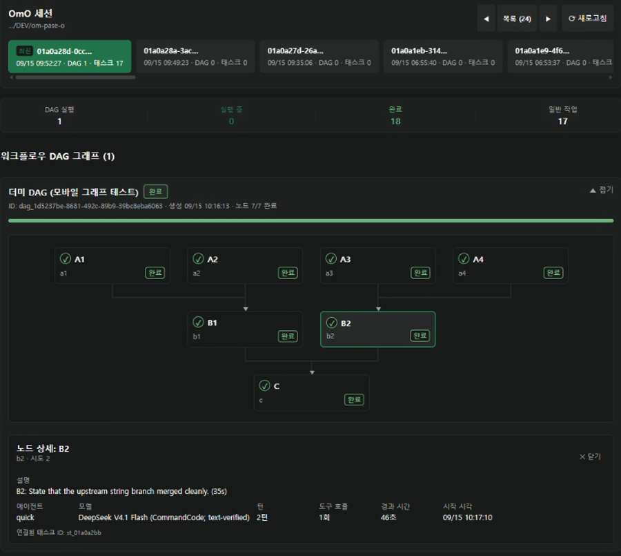

<div align="center">

# pase-omo

**[Paseo](https://getpaseo.com) 안에서 도는 [OmO](https://github.com/code-yeongyu).**

읽을 수 있는 워크플로우 DAG. 실시간으로 체크되는 투두.
실제로 답할 수 있는 질문. 데스크탑에서도, 폰에서도.

[English](README.md) · [한국어](README.ko.md)

</div>


---

## 무엇이 되나

### 에이전트 프로바이더로서의 OmO

설치하면 OmO가 Paseo 모델 선택기에 다른 에이전트와 똑같이 나타난다. 세션, 스트리밍,
도구 호출, 자식 에이전트가 전부 Paseo의 채팅을 통해 돈다.

### 워크플로우 DAG를 그래프로

`workflow` 실행이 채팅 타임라인에 진짜 의존성 그래프로 그려진다. 선행 노드가 끝나면
화살표가 초록으로 바뀌고, 상태가 바뀔 때마다 카드가 쌓이는 대신 실행 하나당 한 장을
유지한다.


같은 실행이 사이드 패널에서도 열린다. 프로젝트 아래 모든 세션과 실행/작업 수가 함께
보이고, 노드를 누르면 인스펙터가 열린다 — 설명, 실행한 에이전트와 모델, 턴 수와 도구
호출 수, 경과 시간, 연결된 태스크 ID.



### 실시간으로 체크되는 투두 카드

Paseo 기본 투두 행을 대체해서, 턴이 아직 스트리밍되는 중에도 제자리에서 갱신되는
카드를 그린다. 긴 텍스트를 다시 읽는 대신 체크리스트가 차오르는 걸 보면 된다.


### 승인 · 질문 · 선택

OmO가 확인이나 목록 선택, 자유 답변이 필요할 때 팝업으로 뜬다. 추천 답변은 버튼으로
나오고, 스크롤을 내려놨어도 놓치지 않도록 컴포저에 `Needs reply` pill이 함께 뜬다.


### 컴포저 pill

컴포저는 항상 화면에 떠 있는 유일한 슬롯이라 pill을 거기 둔다. DAG pill은 실행 중인
그래프를 팝오버로 열고, 승인 pill은 대기 중인 요청을 연다.


### 패널

| 패널 | 내용 |
| --- | --- |
| **OmO DAG** | 프로젝트 경로 아래의 모든 세션, 실행/작업 수, 선택한 실행의 전체 그래프 |
| **OmO Approvals** | 현재 에이전트의 대기 중인 확인·선택·질문 |
| **OmO Folders** | 세션·실행·작업을 묶어 탐색하는 트리 |

셋 다 커맨드 센터나 워크스페이스 탭에서 연다.

### 폰에서도 제대로

좁은 화면에서 평면 목록으로 퇴화하지 않고, 모든 화면이 같은 가독성 계약을 따른다.
그래프는 세로로 눕고, 가독성 하한까지만 축소된 뒤 스크롤로 넘어간다. 글자도 자체
하한에서 멈추고, 두 줄이 안 들어가는 노드는 라벨을 자르는 대신 상태 단어를 버린다
(상태는 색과 테두리가 이미 말해준다).

<table>
<tr>
<td></td>
<td></td>
<td></td>
<td></td>
</tr>
<tr>
<td align="center"><sub>채팅 DAG 카드</sub></td>
<td align="center"><sub>DAG pill 시트</sub></td>
<td align="center"><sub>승인 시트</sub></td>
<td align="center"><sub>실시간 투두 카드</sub></td>
</tr>
</table>

---

## 요구사항

- **Paseo 0.8.0 이상** (`paseo-plugin.json`에 선언되어 있다)
- **OmO** 설치 및 실행 가능 상태 — 플러그인은 `omo` 실행 파일을 먼저 `PATH`에서 찾고,
  없으면 Bun 글로벌 설치
  (`~/.bun/install/global/node_modules/omo-ai/bin/omo.js`)로 폴백한다

## 설치

Paseo는 Git 소스에서 플러그인을 바로 설치한다. Paseo 데몬이 도는 머신에서:

```bash
paseo plugin add Hakubisual/pase-omo
```

GitHub `owner/repository` 단축 표기다. 전체 Git URL도 된다:

```bash
paseo plugin add https://github.com/Hakubisual/pase-omo.git
```

`--ref`를 생략하면 저장소 기본 브랜치를 추적한다. 커밋이나 태그로 고정하거나 다른
브랜치를 추적하려면 직접 넘긴다:

```bash
paseo plugin add Hakubisual/pase-omo --ref main
```

### 한국어 인터페이스

`ko` 브랜치가 모든 문자열이 한국어인 같은 플러그인이다:

```bash
paseo plugin add Hakubisual/pase-omo --ref ko
```

### 관리

```bash
paseo plugin ls              # 설치된 플러그인과 런타임 id
paseo plugin status          # 추적 중인 ref를 fetch해 설치본과 가용본 비교
paseo plugin update omo      # 이 플러그인 업데이트
paseo plugin update --all    # 전체 업데이트
paseo plugin logs omo        # 최근 플러그인 로그
```

런타임 id는 **`omo`**로 등록된다. 데몬에 이미 같은 id가 있으면 설치할 때 `--id`로 다른
값을 주면 된다.

### 로컬 체크아웃에서

```bash
git clone https://github.com/Hakubisual/pase-omo.git
paseo plugin install /absolute/path/to/pase-omo
```

> **추가하는 플러그인은 전부 신뢰한다는 뜻이다.** Paseo 플러그인은 샌드박스되지 않는다.
> 서버 코드는 데몬 호스트에서 데몬 사용자 권한으로 돌고, 클라이언트 기여분은 Paseo 앱
> 안에서 실행된다. 설치는 그 코드베이스와 의존성, 그리고 앞으로의 업데이트까지
> 신뢰하겠다는 결정이다.

---

## 개발

```bash
bun install
bun x tsc --noEmit    # 타입
bun x vitest run      # 테스트
```

`build` 단계를 선언하지 않으므로 Paseo가 설치 시 소스를 직접 컴파일한다. 따로 만들
번들이 없다.

`extension/omo-tools.ts`는 OmO 쪽 절반이다. OmO가 직접 Paseo 터미널 워커를 띄우고
조회할 수 있도록 `paseo_workers` 도구를 노출하는 선택적 확장이며, senpi 확장 API를
로컬 구조적 선언(`extension/senpi-types.ts`)으로 타입 지정해서 senpi 체크아웃 없이도
저장소가 설치·타입체크 가능하다.

| 경로 | 역할 |
| --- | --- |
| `index.client.tsx` | 모든 클라이언트 기여점: 패널, 서피스, 커맨드 항목, 렌더러, pill |
| `index.server.ts` | 데몬 측: 에이전트 프로바이더, DAG/승인/워커 RPC, 타임라인 퍼블리셔 |
| `client/` | React Native 뷰 — 그래프 레이아웃과 비주얼, DAG 패널, 승인, 폴더, 투두 카드 |
| `server/` | 프로바이더, 세션 스토어, DAG 스냅샷 리더, 워커 매니저 |
| `shared/` | 양쪽이 공유하는 행 스키마와 RPC 계약 |

---

## 감사

**[연규 — github.com/code-yeongyu](https://github.com/code-yeongyu)** 님께 진심으로
샤라웃 드립니다. OmO를 만드신 분입니다.

OmO는 제 인생을 바꿔주고 있습니다. 일하는 방식도, 속도도, 한 사람이 하루에 실제로 뭘
만들어낼 수 있는지에 대한 기준 자체를 바꿔놨어요. 이 플러그인도 결국 OmO가 뭘 하고
있는지 *눈으로 보고 싶어서* 만든 거고, 그분의 작업이 없었으면 아예 존재하지 않았을
겁니다. 뭘 만드시는지 꼭 한번 보세요.

그리고 에이전트가 자기 인터페이스를 통째로 들고 들어올 수 있을 만큼 열린 플러그인
API를 만들어준 [Paseo](https://getpaseo.com) 팀에도 감사드립니다.

---

## 라이선스

MIT
