<div align="center">

# pase-omo

**[OmO](https://github.com/code-yeongyu) — inside [Paseo](https://getpaseo.com).**

Workflow DAGs you can read. Todo lists that tick off live.
Questions you can actually answer. On desktop and on your phone.

[English](README.md) · [한국어](README.ko.md)

</div>

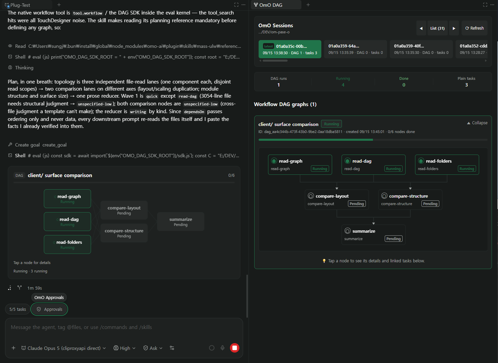

---

## What you get

### OmO as an agent provider

Once installed, OmO shows up in Paseo's model picker like any other agent.
Sessions, streaming, tool calls and child agents all run through Paseo's own chat.

### Workflow DAGs, drawn as graphs

Every `workflow` run becomes a real dependency graph in the chat timeline. Arrows
turn green as upstream nodes finish, and the run keeps one card instead of
stacking a new one on every state change.

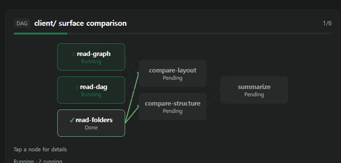

The same run opens in a side panel with every session under the project, run and
task counts, and an inspector: tap any node for its description, the agent and
model that ran it, turn and tool-call counts, elapsed time and the linked task id.

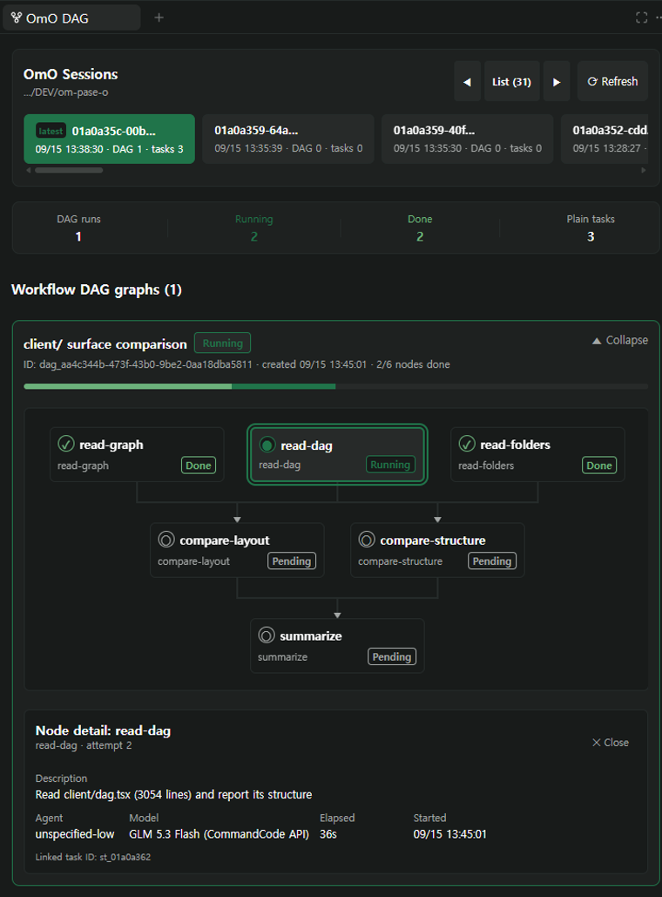

### Todo cards that tick off live

The plugin replaces Paseo's built-in todo row with a card that updates in place
while the turn is still streaming — you watch the checklist fill instead of
re-reading a wall of text.

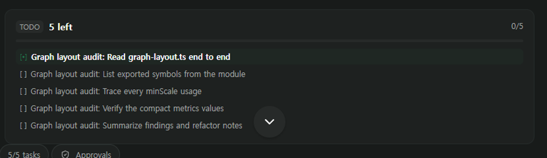

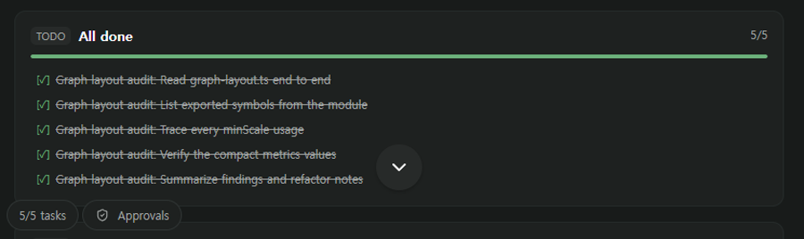

### Approvals, questions and choices

When OmO needs a confirmation, a pick from a list, or a free-text answer, it
arrives as a popup with the suggested answers as buttons — plus a `Needs reply`
pill in the composer so you never miss one while scrolled away.

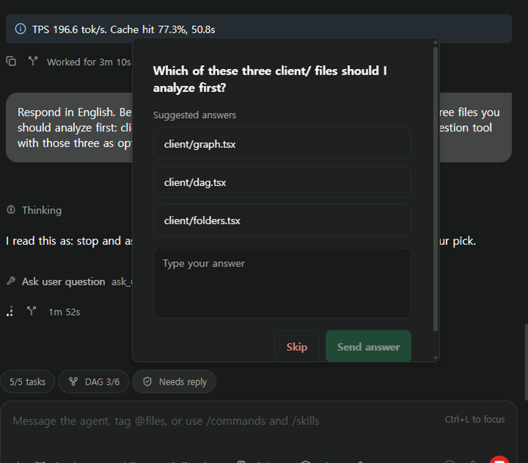

### Composer pills

The composer is the one surface that is always on screen, so that is where the
pills live. The DAG pill opens the running graph in a popover; the approvals pill
opens any pending request.

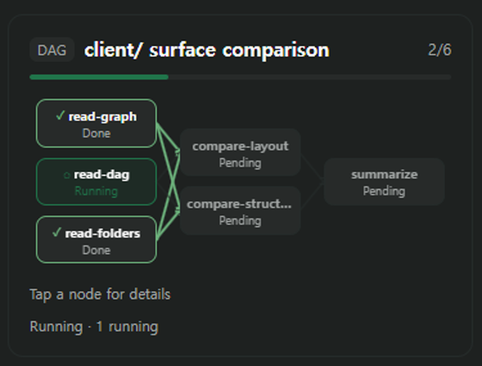

### Panels

| Panel | What it shows |
| --- | --- |
| **OmO DAG** | Every session under a project path, run and task counts, and the full graph for the selected run |
| **OmO Approvals** | Pending confirmations, choices and questions for the current agent |
| **OmO Folders** | Sessions, runs and tasks grouped into a browsable tree |

All three open from the command center or the workspace tab bar.

### Built for a phone too

Every surface answers to one readability contract instead of degrading into a
flat list on a narrow screen. The graph turns on its side, shrinks only as far as
a readability floor and then scrolls, type stops shrinking at a floor of its own,
and a node too short for two lines drops the state word rather than clipping its
label.

<table>
<tr>
<td>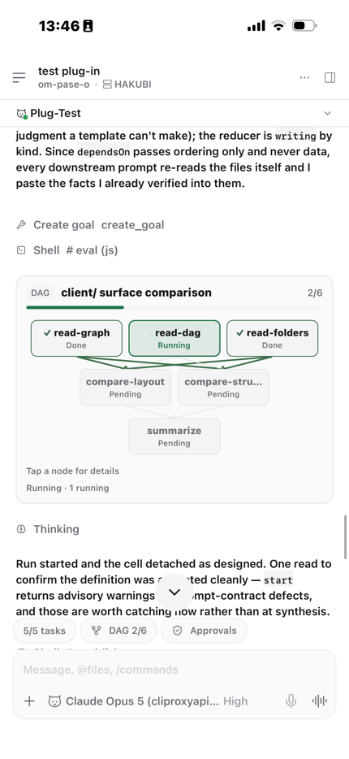</td>
<td>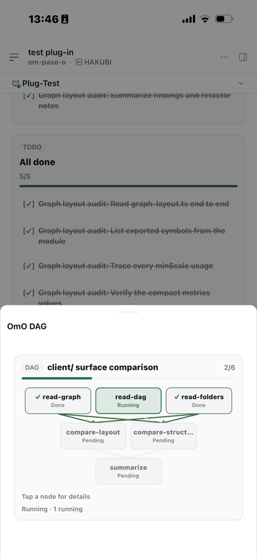</td>
<td>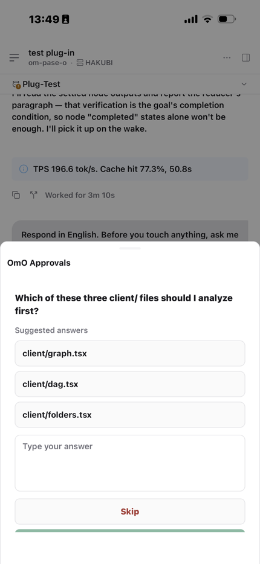</td>
<td>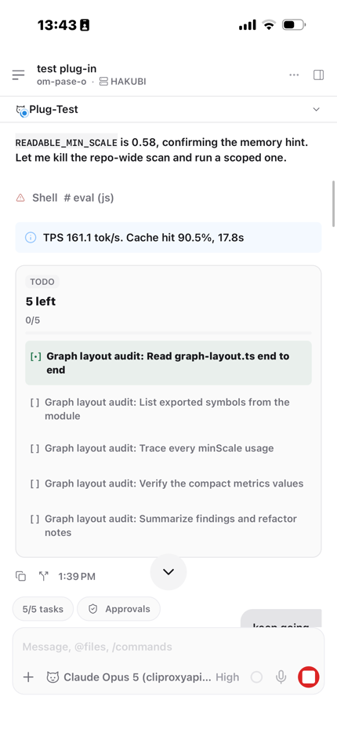</td>
</tr>
<tr>
<td align="center"><sub>Chat DAG card</sub></td>
<td align="center"><sub>DAG pill sheet</sub></td>
<td align="center"><sub>Approvals sheet</sub></td>
<td align="center"><sub>Live todo card</sub></td>
</tr>
</table>

---

## Requirements

- **Paseo 0.8.0 or newer** (declared in `paseo-plugin.json`)
- **OmO** installed and reachable — the plugin resolves the `omo` executable from
  `PATH` first, then falls back to a Bun global install
  (`~/.bun/install/global/node_modules/omo-ai/bin/omo.js`)

## Install

Paseo installs plugins straight from a Git source. On the machine running the
Paseo daemon:

```bash
paseo plugin add Hakubisual/pase-omo
```

That is the GitHub `owner/repository` shorthand. A full Git URL works too:

```bash
paseo plugin add https://github.com/Hakubisual/pase-omo.git
```

Omitting `--ref` tracks the repository's default branch. To pin a commit or tag,
or to track a different branch, pass one:

```bash
paseo plugin add Hakubisual/pase-omo --ref main
```

### Korean interface

The `ko` branch is the same plugin with every string in Korean:

```bash
paseo plugin add Hakubisual/pase-omo --ref ko
```

### Manage it

```bash
paseo plugin ls              # installed plugins and their runtime ids
paseo plugin status          # fetch tracked refs, compare installed vs available
paseo plugin update omo      # update this plugin
paseo plugin update --all    # update everything
paseo plugin logs omo        # recent plugin log tail
```

The plugin registers under the runtime id **`omo`**. Pass `--id` at install time
if that id is already taken on your daemon.

### From a local checkout

```bash
git clone https://github.com/Hakubisual/pase-omo.git
paseo plugin install /absolute/path/to/pase-omo
```

> **Trust every plugin you add.** Paseo plugins are unsandboxed: server code runs
> with the daemon user's access on the daemon host, and client contributions run
> inside the Paseo app. Installing a plugin means trusting its codebase, its
> dependencies and its future updates.

---

## Development

```bash
bun install
bun x tsc --noEmit    # types
bun x vitest run      # tests
```

No `build` step is declared, so Paseo compiles the sources directly on install —
there is no bundle to produce.

`extension/omo-tools.ts` is the OmO-side half: an optional extension exposing a
`paseo_workers` tool so OmO can launch and inspect Paseo terminal workers itself.
It types against a local structural declaration of the senpi extension API
(`extension/senpi-types.ts`), so the repository stays installable and
type-checkable without a local senpi checkout.

| Path | Role |
| --- | --- |
| `index.client.tsx` | Every client contribution: panels, surface, command items, renderers, pills |
| `index.server.ts` | Daemon side: the agent provider, DAG/approval/worker RPCs, timeline publisher |
| `client/` | React Native views — graph layout and visuals, DAG panel, approvals, folders, todo card |
| `server/` | Provider, session store, DAG snapshot readers, worker manager |
| `shared/` | Row schemas and RPC contracts shared by both halves |

---

## Thanks

Huge shout-out to **[YeonGyu — github.com/code-yeongyu](https://github.com/code-yeongyu)**,
the author of OmO.

OmO has genuinely been changing my life — how I work, the pace I work at, and what
I believe one person can actually ship in a day. I built this plugin because I
wanted to *see* what OmO was doing, and none of it would exist without his work.
Go look at what he builds.

And thanks to the [Paseo](https://getpaseo.com) team for a plugin API open enough
that an agent can bring its whole interface with it.

---

## License

MIT
